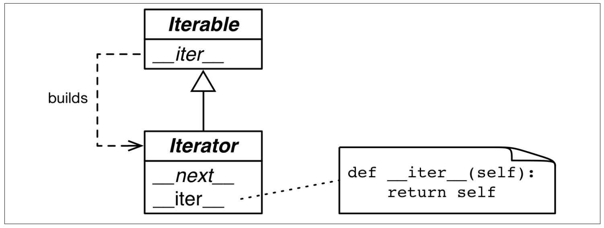

# CHAPTER 14 Iterables, iterators and generators

*When I see patterns in my programs, I consider it a sign of trouble. The shape of a program should reflect only the problem it needs to solve. Any other regularity in the code is a sign, to me at least, that I’m using abstractions that aren’t powerful enough — often that I’m generating by hand the expansions of some macro that I need to write [1].
— Paul Graham
Lisp hacker and venture capitalist*  

当我审视自己程序中的模式时，我认为它是问题的征兆。程序的形状应该只反映出它需要解决的。

Iteration is fundamental to data processing. And when scanning datasets that don’t fit in memory, we need a way to fetch the items lazily, that is, one at a time and on demand. This is what the Iterator pattern is about. This chapter shows how the Iterator pattern is built into the Python language so you never need to implement it by hand.  

迭代是数据处理的基础。当扫描数据集时不要放进内存，我们需要一种惰性获取项的方法，即，

Python does not have macros like Lisp (Paul Graham’s favorite language), so abstracting away the Iterator pattern required changing the language: the yield keyword was added in Python 2.2 (2001)[2]. The yield keyword allows the construction of generators, which work as iterators.  

不像Lisp，Python没有宏，所以抽象出迭代器模式就要求改变语言：在Python 2.2（2001）【注释2】中加入的yield关键子。

>#### Note
>Every generator is an iterator: generators fully implement the iterator interface. But an iterator — as defined in the GoF book — re‐trieves items from a collection, while a generator can produce items “out of thin air”. That’s why the Fibonacci sequence generator is a common example: an infinite series of numbers cannot be stored in a collection. However, be aware that the Python community treats iterator and generator as synonyms most of the time.  

>注释
>每个生成器都是一个迭代器：生成器完全实现了迭代器接口。但迭代器在GOF这本书中定义为：从集合中重新取回项，而生成器则是“凭空”产生项。

1. From Revenge of the Nerds, a blog post.
2. Python 2.2 users could use yield with the directive from __future__ import generators; yield became available by default in Python 2.3.  

1. 来自博文《呆瓜的复仇》。
2. Python 2.2 用户能够利用命令from __future__ import generators运用yield；在Python 2.3中yield默认可用。  

Python 3 uses generators in many places. Even the range() built-in now returns a generator-like object instead of full-blown lists like before. If you must build a list from range, you have to be explicit, e.g. list(range(100)).  

Python 3在很多地方使用了生成器。甚至内建的range()现在也返回一个类生成器对象，而不是之前的完整列表。如果你必须用range构建出一个列表，那么你必须明确的指明，比如，list(range(100))。  

Every collection in Python is iterable, and iterators are used internally to support:  

Python中的每一个集合都是可迭代的，迭代器用于集合的内部以支持以下动作：  

- for loops;  
- collection types construction and extension;  
- looping over text files line by line;  
- list, dict and set comprehensions;  
- tuple unpacking;  
- unpacking actual parameters with * in function calls.  

- 支持循环；
- 集合类型构建以及扩展；
- 一行接一行的循环文本文件；
- 列表、字典和集合解析式；
- 元组解包；
- 在函数调用中使用 * 解包实参。
  
This chapter covers the following topics:  

本章讨论以下话题：  

- How the iter(...) built-in function is used internally to handle iterable objects.  
- How to implement the classic Iterator pattern in Python.  
- How a generator function works in detail, with line by line descriptions.  
- How the classic Iterator can be replaced by a generator function or generator ex‐ pression.  
- Leveraging the general purpose generator functions in the standard library.  
- Using the new yield from statement to combine generators.  
- A case study: using generator functions in a database conversion utility designed to work with large data sets.  
- Why generators and coroutines look alike but are actually very different and should not be mixed.  

- 内建函数iter(...)是如何用在内部去处理可迭代对象的。
- 在Python如何实现典型的迭代器模式
- 生成器函数具体是如何工作的，我们一字一句得来说一说
- 改进标准库中的普通用途生成器函数
- 在语句中使用新的yield来合并生成器
- 案例研究：在数据库中使用生成器函数转变实用设计以便用大数据集。
- 为什么生成器和协程看起相似，但实际上有着很大不同，所以不要把它们给弄混淆了。

We’ll get started studying how the iter(...) function makes sequences iterable.  

我们从研习iter(...)函数如何使序列可迭代开始。  

## Sentence take #1: a sequence of words

We’ll start our exploration of iterables by implementing a Sentence class: you give its constructor a string with some text, and then you can iterate word by word. The first version will implement the sequence protocol, and it’s iterable because all sequences are iterable, as we’ve seen before, but now we’ll see exactly why.  

我们通过实现的Sentence类开始对可迭代的探究：你对类的构造器赋值一些文本，然后你就可以一个词接着一个词的迭代。第一个版本会将实现序列协议，

Example 14-1 shows a Sentence class that extracts words from a text by index.  

例子14-1 展示了一个通过索引从文本提取单词的Sentence类。  

*Example 14-1. sentence.py: A Sentence as a sequence of words.*

*例子14-1.sentence.py：由单词序列组成的Sentence*

```python
import re
import reprlib


RE_WORD = re.compile('\w+')


class Sentence:
    def __init__(self, text):
        self.text = text
	  	self.words = RE_WORD.findall(text) # 1

    def __getitem__(self, index):
        return self.words[index]  # 2

    def __len__(self):
        return len(self.words) 

    def __repr__(self):
        return 'Sentence(%s)' % reprlib.repr(self.text)
```

1. `re.findall` returns a list with all non-overlapping matches of the regular
expression, as a list of strings.  
2. `self.words` holds the result of `.findall`, so we simply return the word at the given index.  
3. To complete the sequence protocol, we implement `__len__` — but it is not needed to make an iterable object.  
4. `reprlib.repr` is a utility function to generate abbreviated string representations of data structures that can be very large [3].

1. `re.findall`返回一个正则表达式的所有不重叠匹配的列表。
2. `self.words`包含了`.findall`的结果，所以我们就简单地返回指定索引的单词。
3. 为了完成序列协议，我们实现了`__len__`，但是对于生成可迭代对象来所，这并不是必须的。
4. `reprlib.repr`是一个用来生成大量数据的字符串显示缩写的实用函数【注释3】。

[注释3] We first used reprlib in “Vectortake#1:Vector2dcompatible” on page 278.`  


By default, `reprlib.repr` limits the generated string to 30 characters. See the following console session to see how `Sentence` is used:  

默认情况下，`reprlib.repr`限制生成的字符串为30个字符串。在下列终端中的会话你可以看到Sentence是如何使用的：  

*Example 14-2. Testing iteration on a Sentence instance.*  

```python
>>> s = Sentence('"The time has come," the Walrus said,') # 1
>>> s
Sentence('"The time ha... Walrus said,') # 2
>>>for word in s: # 3
...   print(word) 
The
time
has
come
the
Walrus
said
>>> list(s) # 4
['The', 'time', 'has', 'come', 'the', 'Walrus', 'said']
```

1. A sentence is created from a string.  
2. Note the output of `__repr__` using `...` generated by reprlib.repr.  
3. Sentence instances are iterable, we’ll see why in a moment.  
4. Being iterable, Sentence objects can be used as input to build lists and other iterable types.  

1. 创建了一个字符串句子。
2. 注意`__repr__`的输出，它使用了通过由reprlib.repr生成的`...`。
3. Sentence实例是可迭代的，稍后我们来看看为什么。
4. 因为可迭代，所以Sentence对象可以用于输入以构造列表和其他可迭代类型。

In the next pages, we’ll develop other Sentence classes that pass the tests in Example 14-2. However, the implementation in Example 14-1 is different from all the others because it’s also a sequence, so you can get words by index:  

在下一页，我们会编写其他的Sentence在例子14-2中通过测试的类。不过，在例子14-1中实现的例子和其他的所有例子都不相同，因为结果就是一个序列，所以能通过索引获取单词：  

```python
>>> s[0]
  'The' 
>>> s[5]
  'Walrus'
>>> s[-1]
 'said'
```


Every Python programmer knows that sequences are iterable. Now we’ll see precisely why.  

每个Python程序员都知道序列是可迭代的。现在我们来仔细的一探究竟。  

## Why sequences are iterable: the iter function
## 为什么序列可以迭代：iter函数
Whenever the interpreter needs to iterate over an object x, it automatically calls iter(x). The iter built-in function:  

不论何时当解释器需要迭代对象x时，它会自动地调用iter(x)。iter为内建函数：  

1. Checks whether the object implements, `__iter__`, and calls that to obtain an iterator;  
2. If `__iter__` is not implemented, but `__getitem__` is implemented, Python creates an iterator that attempts to fetch items in order, starting from index 0 (zero);  
3. If that fails, Python raises TypeError, usually saying "'C' object is not itera ble", where C is the class of the target object.  

1. 检查对象是否实现`__iter__`，并调用它来获得一个迭代器；
2. 如果没有实现`__iter__`，而是实现了`__getitem__`，Python会创建一个迭代器，从索引0开始，尝试按顺序去获取项；
3. 如果以上方法调用都失败了，Python抛出TypeError，通常是“C object is not iterable”，这里C是目标对象的类。

That is why any Python sequence is iterable: they all implement `__getitem__	`. In fact, the standard sequences also implement `__iter__`, and yours should too, because the special handling of `__getitem__` exists for backward compatibility reasons and may be gone in the future (although it is not deprecated as I write this).  

这就是为什么Python序列可以迭代的原因：它们都实现了`__getitem__`。实际上，标准序列也实现了`__iter__`，而且你的自定义序列也应该如此，因为现有的为了向后兼容性的特殊处理 `__getitem__`，在未来或许会消失（尽管在我写本书时还没有移除）。  

As mentioned in “Python digs sequences” on page 312, this is an extreme form of duck typing: an object is considered iterable not only when it implements the special method `__iter__`, but also when it implements `__getitem__`, as long as `__getitem__` accepts int keys starting from 0.  

就像在312页中提及的“深入Python序列”那样，这就是一个鸭子类型的一个极致表现：一个对象被认为是可迭代的不仅仅是它实现了特殊方法`__iter__`，还实现了`__getitem__`，只要`__getitem__`能够接受从0开始的整数键。  

In the goose-typing approach, the definition for an iterable is simpler but not as flexible: an object is considered iterable if it implements the `__iter__` method. No subclassing or registration is required, because abc.Iterable implements the `__subclasshook__`, as seen in “Geese can behave as ducks” on page 340. Here is a demonstration:  

在鹅类型方法中，可迭代的定义简单但是不那么灵活：如果一个对象实现了`__iter__`方法便认为是可迭代的。没有子类化或者注册上的要求，因为abc.Iterable实现了`__subclasshook__`，你可以在340页中的“鹅的行为可以像鸭子”中见到。这里对其说明：  

```python
>>> class Foo:
...     def __iter__(self):
...         pass
...
>>> from collections import abc 
>>> issubclass(Foo, abc.Iterable) 
True
>>> f = Foo()
>>> isinstance(f, abc.Iterable) 
True
```

However, note that our initial Sentence class does not pass the issubclass(Sentence, abc.Iterable) test, even though it is iterable in practice.  

不过，值得注意的是第一版Sentence类并没有通过issubclass(Sentence, abc.Iterable)测试，即便实际上它是可迭代的。  


>#### Note
>As of Python 3.4, the most accurate way to check whether an object x is iterable is to call iter(x) and handle a TypeError exception if it isn’t. This is more accurate than using isinstance(x, abc.Iterable), because iter(x) also considers the legacy  `__getitem__` method, while the Iterable ABC does not. 

>#### 注释
>从Python 3.4开始，检查对象x是否是可迭代的最精确方法为调用iter(x)，并在对象不可迭代时处理TypeError异常。这比使用isinstance(x, abc.Iterable)更为精准，因为iter(x)还使用了早期的`__getitem__`方法，而Iterable ABC则不然。

Explicitly checking whether an object is iterable may not be worthwhile if right after the check you are going to iterate over the object. After all, when the iteration is attempted on a noniterable, the exception Python raises is clear enough: TypeError: 'C' object is not iterable . If you can do better than just raising TypeError, then do so in a try/except block instead of doing an explicit check. The explicit check may make sense if you are holding on to the object to iterate over it later; in this case, catching the error early may be useful.  

如果这之后你立刻作出迭代玩整个对象，而明确地检查一个对象是否可迭代有些得不偿失。毕竟，当迭代的尝试发生在一个不可迭代身上时，Python抛出的异常足够清楚了：TypeError: 'C' object is not iterable。假如你要做的更好些，那么你可以在try/except语句块中这样做，而不是执行一个明确地检查。如果你正在打算

The next section makes explicit the relationship between iterables and iterators.  

下一节将明确一下可迭代和迭代器之间的关系。  

### Iterables Versus Iterators
### 可迭代与迭代器
From the explanation in “Why Sequences Are Iterable: The iter Function” on page 404 we can extrapolate a definition:  

从404页中的定义“为什么序列是可迭代：iter函数”中我们可以推断定义：  

*iterable*  
    Any object from which the iter built-in function can obtain an iterator. Objects implementing an `__iter__` method returning an iterator are iterable. Sequences are always iterable; as are objects implementing a `__getitem__` method that takes 0-based indexes.  

*可迭代*  
    任何来自内建iter函数的对象都可以的迭代器。对象实现了`__iter__`方法，能够返回一个迭代器便是可迭代的。序列总是可迭代的；因为对象实现了能够接受从0开始的索引的`__getitem__`方法。 

It’s important to be clear about the relationship between iterables and iterators: Python obtains iterators from iterables.  

重要的是要弄清楚可迭代和迭代器之间的关系：Python从可迭代中获得迭代器。  

Here is a simple for loop iterating over a str. The str 'ABC' is the iterable here. You don’t see it, but there is an iterator behind the curtain:  

这里有一个简单的迭代字符串的for循环。此处的'ABC'是可迭代的。你虽然看不见它，但是在幕后有一个迭代器在工作：  

```
>>> s =  'ABC'
>>> for char in s: 
...     print(char) 
...
A
B
C
```

If there was no for statement and we had to emulate the for machinery by hand with a while loop, this is what we’d have to write:  

如果没有for语句，那么我们就得自己手动使用while循环来模拟for机制，这里就是我们必须去编写的：  

```shell
>>> s = 'ABC'
>>> it = iter(s) # 1
>>> while True: # 2
...     try:
...         print(next(it))
...     except StopIteration: #3
...         delit # 4
...         break # 5
... 
A 
B 
C
```

    
1. Build an iterator it from the iterable.
2. Repeatedly call next on the iterator to obtain the next item.
3. The iterator raises StopIteration when there are no further items. 
4. Release reference to it—the iterator object is discarded.
5. Exit the loop.

1. 从可迭代对象中构造一个迭代器。
2. 对迭代器重复地调用next以获取下一个项。
3. 在没有更多的项时迭代器抛出StopIteration。
4. 释放对it的引用，即迭代器被丢弃。
5. 退出循环

StopIteration signals that the iterator is exhausted. This exception is handled inter‐nally in for loops and other iteration contexts like list comprehensions, tuple unpacking, etc.  

StopIteration指示迭代器迭代完了。这个异常是在for循环内部被处理的，以及其他的迭代上下文，比如列表解析式、元组解包等等。  

The standard interface for an iterator has two methods:  

迭代器的标准接口有两个方法：  

*__next__*
    Returns the next available item, raising StopIteration when there are no more items.  

*__iter__*
    Returns self; this allows iterators to be used where an iterable is expected, for example, in a for loop.  

*__next__*
    返回下一个可用的项，在没有更多可用项时抛出StopIteration。  

*__iter__*
    返回self；允许将迭代器用在期望可迭代的地方，例如，在循环中。  

This is formalized in the collections.abc.Iterator ABC, which defines the `__next__` abstract method, and subclasses Iterable—where the abstract `__iter__` method is defined. See Figure 14-1.  

在collections.abc.Iterator ABC中这是标准化用法，它定义了 `__next__` 抽象方法，以及可迭代的子类——即定义抽象`__iter__`方法的地方。参见图表14-1.  

  

*Figure 14-1. The Iterable and Iterator ABCs. Methods in italic are abstract. A concrete Iterable.iter should return a new Iterator instance. A concrete Iterator must implement next. The Iterator.iter method just returns the instance itself.*  

*图表14-1. 可迭代和迭代器ABC。以斜体字显示的方法是抽象的。具体的Iterable.iter应该返回一个新的迭代器实例。具体的迭代器必须使用next方法。Iterator.iter方法仅仅返回了自身。*

The Iterator ABC implements `__iter__` by doing return self. This allows an iterator to be used wherever an iterable is required. The source code for abc.Iterator is in Example 14-3.  

迭代器ABC通过返回自身实现了`__iter__`。这就让一个迭代器

*Example 14-3. abc.Iterator class; extracted from Lib/_collections_abc.py*  

*例子14-3. 类abc.Iterator；提取自Lib/_collections_abc.py*

```python
class Iterator(Iterable):
    __slots__ = ()

    @abstractmethod
    def __next__(self):
        'Return the next item from the iterator. When exhausted, raise StopIteration' 
        raise StopIteration
    
    def __iter__(self): 
        return self
    
    @classmethod
    def __subclasshook__(cls, C): 
        if cls is Iterator:
            if (any("__next__" in B.__dict__ for B in C.__mro__) and any("__iter__" in B.__dict__ for in C.__mro__)):
                return True 
        return NotImplemented
```

>#### Warning
>The Iterator ABC abstract method is `it.__next__()` in Python 3 and `it.next()` in Python 2. As usual, you should avoid calling special methods directly. Just use the `next(it)`: this built-in func‐ tion does the right thing in Python 2 and 3.

>#### 警告⚠️
>迭代器ABC的抽象方法在Python 3中是`it.__next__()`在Python 2中是`it.next()`.

The `Lib/types.py` module source code in Python 3.4 has a comment that says:  

    # Iterators in Python aren't a matter of type but of protocol.  A large
    # and changing number of builtin types implement *some* flavor of
    # iterator.  Don't check the type!  Use hasattr to check for both
    # "__iter__" and "__next__" attributes instead.

Python 3.4中模块`Lib/types.py`的源代码其注释如是：  

    # Python中的迭代器与类型有关而不是协议。
    # 大量的处在变更中的内建类型实现了“某些”风格的迭代器。
    # 不要检查类型！作为替代请使用hasattr来同时检查属性"__iter__" 和 "__next__"。

In fact, that’s exactly what the `__subclasshook__` method of the abc.Iterator ABC does (see Example 14-3).  

实际上，这正是abc.Iterator的ABC的`__subclasshook__`所做的事情（参见例子14-3）。  

>#### Note
>Taking into account the advice from `Lib/types.py` and the logic implemented in `Lib/_collections_abc.py`, the best way to check if an object x is an iterator is to call isinstance(x, abc.Iterator). Thanks to `Iterator.__subclasshook__`, this test works even if the class of x is not a real or virtual subclass of Iterator.  

>#### 注意
>考虑到`Lib/types.py`的建议，以及`Lib/_collections_abc.py`中实现的逻辑，检查一个对象x是否是一个迭代器的最佳办法是去调用sinstance(x, abc.Iterator)。要感谢`Iterator.__subclasshook__`，这个测试可以正常工作，即便类x不是真的抑或不是Iterator的虚子类。

Back to our Sentence class from Example 14-1, you can clearly see how the iterator is built by iter(...) and consumed by next(...) using the Python console:  

回到我们的例子14-1中来，你可以清楚地看到迭代器是如何由iter(...)构造，然后被next(...)在Python终端中使用： 

```shell
>>> s3 = 'ABC' # 1
>>> it = iter(s) # 1
>>> while True:
...     try:
...         print(next(it)) # 2
...     except StopIteration: # 3
...         del it # 4
...         break # 5
... 
A
B
C
```

1. Create a sentence s3 with three words.
2. Obtain an iterator from s3.
3. next(it) fetches the next word.
4. There are no more words, so the iterator raises a StopIteration exception. Once exhausted, an iterator becomes useless.
5. To go over the sentence again, a new iterator must be built.

1. 创建一个包含三个单词的句子s3
2. 从s3中获取迭代器
3. 调用next(it)取得下一个单词
4. 没有更多的单词了，所以迭代器抛出一个StopIteration异常。一旦可迭代元素用完，迭代器就没有用了。
5. 为了重新把句子再过一遍，必须构建一个新的迭代器。

Because the only methods required of an iterator are `__next__` and `__iter__`, there is no way to check whether there are remaining items, other than to call next() and catch StopInteration. Also, it’s not possible to “reset” an iterator. If you need to start over, you need to call iter(...) on the iterable that built the iterator in the first place. Calling iter(...) on the iterator itself won’t help, because—as mentioned—`Iterator.__iter__` is implemented by returning self, so this will not reset a depleted iter‐ ator.  

因为迭代器唯一要求的方法是`__next__`和`__iter__`，除了调用next() 以捕捉StopInteration之外，而且也没有办法检查剩余的项。而且，也没有可能去“重设”迭代器。如果你需要重新开始，那么怒

To wrap up this section, here is a definition for iterator:  

为了结束本节，这里是迭代器等定义： 

*iterator*
    Any object that implements the `__next__` no-argument method that returns the next item in a series or raises StopIteration when there are no more items. Python iterators also implement the `__iter__` method so they are iterable as well.

*迭代器*
    任何实现了不含参数的`__next__`方法，

This first version of Sentence was iterable thanks to the special treatment the iter(...) built-in gives to sequences. Now we’ll implement the standard iterable protocol.  

Sentence的第一个版本能够迭代，要感谢对分配给语句的内建iter(...)的特殊对待。现在我们要实现标准的迭代协议。  


## Sentence Take #2: A Classic Iterator
The next Sentence class is built according to the classic Iterator design pattern following the blueprint in the GoF book. Note that this is not idiomatic Python, as the next re‐ factorings will make very clear. But it serves to make explicit the relationship between the iterable collection and the iterator object.  

接下来的Sentence类的构造应用了遵循了GoF这本书中的蓝图中经典迭代器设计模式。  

Example 14-4 shows an implementation of a Sentence that is iterable because it imple‐ ments the `__iter__` special method, which builds and returns a SentenceIterator. This is how the Iterator design pattern is described in the original Design Patterns book.  

例子14-4展示了

We are doing it this way here just to make clear the crucial distinction between an iterable and an iterator and how they are connected.  

我们这样做的仅仅是为了区分可迭代和迭代器之间的重要区别，以及它们之间的是如何联系的。  

*Example 14-4. sentence_iter.py: Sentence implemented using the Iterator pattern*  

例子14-4. sentence_iter.py：使用了迭代器模式实现的Sentence

```python
import re
import reprlib
RE_WORD = re.compile('\w+')

class Sentence:
    def __init__(self, text): 
        self.text = text
        self.words = RE_WORD.findall(text) 

    def __repr__(self):
        return 'Sentence(%s)' % reprlib.repr(self.text) 

    def __iter__(self):
        return SentenceIterator(self.words) 


class SentenceIterator:
    def __init__(self, words): 
        self.words = words 
        self.index = 0

    def __next__(self): 
        try:
            word = self.words[self.index] 
        except IndexError:
            raise StopIteration() 
            self.index += 1
        return word 

    def __iter__(self):
        return self
```

1. The __iter__ method is the only addition to the previous Sentence implementation. 
2. This version has no __getitem__, to make it clear that the class is iterable because it implements __iter__.
3. __iter__ fulfills the iterable protocol by instantiating and returning an iterator. 
4. SentenceIterator holds a reference to the list of words.
5. self.index is used to determine the next word to fetch.
6. Get the word at self.index.
7. If there is no word at self.index, raise StopIteration. Increment self.index.
8. Return the word.
9. Implement self.__iter__.

1. 
2. 这个版本没有__getitem__，
3. 
4. SentenceIterator包含了一个对words列表的引用
5. 

The code in Example 14-4 passes the tests in Example 14-2.  

Note that implementing __iter__ in SentenceIterator is not actually needed for this example to work, but the it’s the right thing to do: iterators are supposed to implement both __next__ and __iter__, and doing so makes our iterator pass the issubclass(Sen tenceInterator, abc.Iterator) test. If we had subclassed SentenceIterator from abc.Iterator, we’d inherit the concrete abc.Iterator.__iter__ method.  

注意

That is a lot of work (for us lazy Python programmers, anyway). Note how most code in SentenceIterator deals with managing the internal state of the iterator. Soon we’ll see how to make it shorter. But first, a brief detour to address an implementation shortcut that may be tempting, but is just wrong.  

做了这么多（总而言之，对于我们这些懒惰的Python程序员来说）。注意

### Making Sentence an Iterator: Bad Idea
A common cause of errors in building iterables and iterators is to confuse the two. To be clear: iterables have an __iter__ method that instantiates a new iterator every time. Iterators implement a __next__ method that returns individual items, and an __iter__ method that returns self.  

构建可迭代过程中常见的一个错误起因

Therefore, iterators are also iterable, but iterables are not iterators.  

因此，迭代器也是可迭代的，但是可迭代并不是迭代器。  

It may be tempting to implement __next__ in addition to __iter__ in the Sentence class, making each Sentence instance at the same time an iterable and iterator over itself. But this is a terrible idea. It’s also a common anti-pattern, according to Alex Mar‐ telli who has a lot of experience with Python code reviews.  


The “Applicability” section[4] of the Iterator design pattern in the GoF book says:  

[4.] Gamma et. al., Design Patterns: Elements of Reusable Object-Oriented Software, p. 259.

    Use the Iterator pattern
    • to access an aggregate object’s contents without exposing its internal representation.
    • to support multiple traversals of aggregate objects.
    • to provide a uniform interface for traversing different aggregate structures (that is, to support polymorphic iteration).

To “support multiple traversals” it must be possible to obtain multiple independent iterators from the same iterable instance, and each iterator must keep its own internal state, so a proper implementation of the pattern requires each call to iter(my_itera ble) to create a new, independent, iterator. That is why we need the SentenceItera tor class in this example.    

为了“支持多次遍历”必须有从相同可迭代实例中获得多个独立的迭代的可能，而且没个迭代器必须保留自己的内部状态，所以之前的视线

>#### Tips
>An iterable should never act as an iterator over itself. In other words, iterables must implement __iter__, but not __next__.
On the other hand, for convenience, iterators should be iterable. An iterator’s __iter__ should just return self.  

>#### 提示
>

Now that the classic Iterator pattern is properly demonstrated, we can get let it go. The next section presents a more idiomatic implementation of Sentence.  

## Sentence Take #3: A Generator Function
A Pythonic implementation of the same functionality uses a generator function to re‐ place the SequenceIterator class. A proper explanation of the generator function comes right after Example 14-5.  

相同功能的Python风格实现为使用生成器函数来替换SequenceIterator类。

Example 14-5. sentence_gen.py: Sentence implemented using a generator function  

例子14-5. sentence_gen.py：

```python
import re
import reprlib

RE_WORD = re.compile('\w+') 


class Sentence:

    def __init__(self, text): 
        self.text = text
        self.words = RE_WORD.findall(text) 

    def __repr__(self):
        return 'Sentence(%s)' % reprlib.repr(self.text)

    def __iter__(self):
        for word in self.words:
            yield word 
            return
# done!
```


1. Iterate over self.word.
2. Yield the current word.
3. This return is not needed; the function can just “fall-through” and return automatically. Either way, a generator function doesn’t raise StopIteration: it simply exits when it’s done producing values.[Note-5]
4. No need for a separate iterator class!

1. 迭代整个 self.word。
2. 生成当前的单词。
3. 该return并不需要；
4. 

>[Note-5] When reviewing this code, Alex Martelli suggested the body of this method could simply be return iter(self.words). He is correct, of course: the result of calling __iter__ would also be an iterator, as it should be. However, I used a for loop with yield here to introduce the syntax of a generator function, which will be covered in detail in the next section.  

【注释5】

Here again we have a different implementation of Sentence that passes the tests in
Example 14-2.  

这里我们

Back in the Sentence code in Example 14-4, __iter__ called the SentenceIterator constructor to build an iterator and return it. Now the iterator in Example 14-5 is in fact a generator object, built automatically when the __iter__ method is called, because __iter__ here is a generator function.  

回到例子14-4中的Sentence代码，

A full explanation of generator functions follows.  

### How a Generator Function Works
Any Python function that has the yield keyword in its body is a generator function: a function which, when called, returns a generator object. In other words, a generator function is a generator factory.  

任何在语句体中拥有yield关键的Python函数都是生成器函数：在调用时，该函数返回一个生成器函数。换句话说，生成器函数是生成器工厂。  

>#### Tips
>The only syntax distinguishing a plain function from a generator function is the fact that the latter has a yield keyword some‐ where in its body. Some argued that a new keyword like gen should be used for generator functions instead of def, but Guido did not agree. His arguments are in PEP 255 — Simple Generators.[6]

>#### 提示
>

>[6]Sometimes I add a gen prefix or suffix when naming generator functions, but this is not a common prac‐ tice. And you can’t do that if you’re implementing an iterable, of course: the necessary special method must be named __iter__.

Here is the simplest function useful to demonstrate the behavior of a generator:[7] 

这里是一个简单的对于阐明生成器行为很有用的函数【注释7】： 

>[7]Thanks to David Kwast for suggesting this example.
【注释7】感谢David Kwast对于这个例子的建议。

```
>>> def gen_123(): #
... yield1#
... yield 2
... yield 3
...
>>> gen_123 # 
doctest: +ELLIPSIS <function gen_123 at 0x...> #
>>> gen_123() # 
doctest: +ELLIPSIS <generator object gen_123 at 0x...> # 
>>> for i in gen_123(): #
... print(i)
1
2
3
>>> g = gen_123() # 
>>> next(g) #
1
>>> next(g)
2
>>> next(g)
3
>>> next(g) #
Traceback (most recent call last):
...
    StopIteration
```

1. Any Python function that contains the yield keyword is a generator function. 
2. Usually the body of a generator function has loop, but not necessarily; here I just repeat yield three times.
3. Looking closely, we see gen_123 is a function object.
4. But when invoked, gen_123() returns a generator object.
5. Generators are iterators that produce the values of the expressions passed to yield.
6. For closer inspection, we assign the generator object to g.
7. Because g is an iterator, calling next(g) fetches the next item produced by yield.
8. When the body of the function completes, the generator object raises a StopIt eration.

1. 
2. 通常生成器函数主体包含循环，但并不是必须的；这里我只是把yield重复了三次。
3. 进一步来看，我们可以看到gen_123是一个函数对象。
4. 但是在调用时，gen_123（）返回一个生成器对象。
5. 

A generator function builds a generator object that wraps the body of the function. When we invoke next(...) on the generator object, execution advances to the next yield in the function body, and the next(...) call evaluates to the value yielded when the func‐ tion body is suspended. Finally, when the function body returns, the enclosing generator object raises StopIteration, in accordance with the Iterator protocol.  

生成器函数构建了一个包含函数主体的生成器对象。当我们对生成器对象调用next(...)时，

>#### Tips
>I find it helpful to be strict when talking about the results ob‐ tained from a generator: I say that a generator yields or produces values. But it’s confusing to say a generator “returns” values. Func‐ tions return values. Calling a generator function returns a gener‐ ator. A generator yields or produces values. A generator doesn’t “return” values in the usual way: the return statement in the body of a generator function causes StopIteration to be raised by the generator object.[8]  

>##### 提示
>

>[8] Prior to Python 3.3, it was an error to provide a value with the return statement in a generator function. Now that is legal, but the return still causes a StopIteration exception to be raised. The caller can retrieve the return value from the exception object. However, this is only relevant when using a generator func‐ tion as a coroutine, as we’ll see in “Returning a Value from a Coroutine” on page 475.

【注释8】在Python3.3之前，在生成器函数的为return语句中提供值是件错误的事情，但是reurn仍旧引发StopIteration异常的抛出。调用者可以在exception对象中重新去回值。不过，

Example 14-6 makes the interaction between a for loop and the body of the function more explicit.  

例子14-6，

Example 14-6. A generator function that prints messages when it runs  

例子14-6. 一个在运行时答应消息的函数

```
>>> def gen_AB(): #
...     print('start') 
...     yield 'A' # 
...     print('continue') 
...     yield 'B' # 
...     print('end.') # 
...
>>> for c in gen_AB(): # 
...     print('-->', c) # 
...
start
--> A
continue
--> B
end.
>>>
```

1. The generator function is defined like any function, but uses yield.
2. The first implicit call to next() in the for loop at will print 'start' and 
stop at the first yield, producing the value 'A'.
3. The second implicit call to next() in the for loop will print 'continue' and 
stop at the second yield, producing the value 'B'.
4. The third call to next() will print 'end.' and fall through the end of the function 
body, causing the generator object to raise StopIteration.
To iterate, the for machinery does the equivalent of g = iter(gen_AB()) to get a generator object, and then next(g) at each iteration.
The loop block prints --> and the value returned by next(g). But this output will be seen only after the output of the print calls inside the generator function.
The string 'start' appears as a result of print('start') in the generator function body.
yield 'A' in the generator function body produces the value A consumed by the for loop, which gets assigned to the c variable and results in the output -- > A.
Iteration continues with a second call next(g), advancing the generator function body from yield 'A' to yield 'B'. The text continue is output because of the second print in the generator function body.
yield 'B' produces the value B consumed by the for loop, which gets assigned to the c loop variable, so the loop prints --> B.
Iteration continues with a third call next(it), advancing to the end of the body of the function. The text end. appears in the output because of the third print in the generator function body.
12. When the generator function body runs to the end, the generator object raises StopIteration. The for loop machinery catches that exception, and the loop terminates cleanly.

1. 生成器函数和其他任意函数一样来定义，除了使用yield之外。
2. 在for循环中第一次明确调用next()会打印
3. 
4. 

Now hopefully it’s clear how Sentence.__iter__ in Example 14-5 works: __iter__ is a generator function which, when called, builds a generator object that implements the iterator interface, so the SentenceIterator class is no longer needed.  

现在

This second version of Sentence is much shorter than the first, but it’s not as lazy as it could be. Nowadays, laziness is considered a good trait, at least in programming lan‐ guages and APIs. A lazy implementation postpones producing values to the last possible moment. This saves memory and may avoid useless processing as well.  

We’ll build a lazy Sentence class next.  

## Sentence Take #4: A Lazy Implementation
The Iterator interface is designed to be lazy: next(my_iterator) produces one item at a time. The opposite of lazy is eager: lazy evaluation and eager evaluation are actual technical terms in programming language theory.  

Our Sentence implementations so far have not been lazy because the __init__ eagerly builds a list of all words in the text, binding it to the self.words attribute. This will entail processing the entire text, and the list may use as much memory as the text itself (probably more; it depends on how many nonword characters are in the text). Most of this work will be in vain if the user only iterates over the first couple words.  

Whenever you are using Python 3 and start wondering “Is there a lazy way of doing this?”, often the answer is “Yes.”  

The re.finditer function is a lazy version of re.findall which, instead of a list, re‐ turns a generator producing re.MatchObject instances on demand. If there are many matches, re.finditer saves a lot of memory. Using it, our third version of Sentence is now lazy: it only produces the next word when it is needed. The code is in Example 14-7.  

Example 14-7. sentence_gen2.py: Sentence implemented using a generator function calling the re.finditer generator function  

```python
import re
import reprlib
RE_WORD = re.compile('\w+') 

class Sentence:
    def __init__(self, text): 
        self.text = text

    def __repr__(self):
        return 'Sentence(%s)' % reprlib.repr(self.text)

    def __iter__(self):
        for match in RE_WORD.finditer(self.text):
            yield match.group()
```

No need to have a words list.
finditer builds an iterator over the matches of RE_WORD on self.text, yielding MatchObject instances.
match.group() extracts the actual matched text from the MatchObject instance.

Generator functions are an awesome shortcut, but the code can be made even shorter
with a generator expression.  

## Sentence Take #5: A Generator Expression
Simple generator functions like the one in the previous Sentence class (Example 14-7) can be replaced by a generator expression.  

A generator expression can be understood as a lazy version of a list comprehension: it does not eagerly build a list, but returns a generator that will lazily produce the items on demand. In other words, if a list comprehension is a factory of lists, a generator expression is a factory of generators.  

Example 14-8 is a quick demo of a generator expression, comparing it to a list compre‐ hension.  

Example 14-8. The gen_AB generator function is used by a list comprehension, then by a generator expression  

```

>>> def gen_AB(): #
... print('start') 
... yield 'A'
... print('continue') 
... yield 'B'
... print('end.')
...
>>> res1 = [x*3 for x in gen_AB()] # start
continue
end.
>>>foriinres1: #
... print('-->', i)
...
--> AAA
--> BBB
>>> res2 = (x*3 for x in gen_AB()) #
>>> res2 #
<generator object <genexpr> at 0x10063c240> 
>>>foriinres2: #
... print('-->', i)
...
start
--> AAA
continue
--> BBB
end.
```

1. This is the same gen_AB function from Example 14-6.
The list comprehension eagerly iterates over the items yielded by the generator object produced by calling gen_AB(): 'A' and 'B'. Note the output in the next lines: start, continue, end.
This for loop is iterating over the res1 list produced by the list comprehension. The generator expression returns res2. The call to gen_AB() is made, but that
call returns a generator, which is not consumed here. res2 is a generator object.
6. Only when the for loop iterates over res2, the body of gen_AB actually executes. Each iteration of the for loop implicitly calls next(res2), advancing gen_AB to the next yield. Note the output of gen_AB with the output of the print in the for loop.

So, a generator expression produces a generator, and we can use it to further reduce the code in the Sentence class. See Example 14-9.  

Example 14-9. sentence_genexp.py: Sentence implemented using a generator expression  

```python
import re
import reprlib
RE_WORD = re.compile('\w+') 

class Sentence:
    def __init__(self, text): 
        self.text = text

    def __repr__(self):
        return 'Sentence(%s)' % reprlib.repr(self.text)

    def __iter__(self):
        return (match.group() for match in RE_WORD.finditer(self.text))
```

The only difference from Example 14-7 is the __iter__ method, which here is not a generator function (it has no yield) but uses a generator expression to build a generator and then returns it. The end result is the same: the caller of __iter__ gets a generator object.  

Generator expressions are syntactic sugar: they can always be replaced by generator functions, but sometimes are more convenient. The next section is about generator expression usage.  

## Generator Expressions: When to Use Them
I used several generator expressions when implementing the Vector class in Example 10-16. Each of the methods __eq__, __hash__, __abs__, angle, angles, format, __add__, and __mul__ has a generator expression. In all those methods, a list comprehension would also work, at the cost of using more memory to store the inter‐ mediate list values.  

In Example 14-9, we saw that a generator expression is a syntactic shortcut to create a generator without defining and calling a function. On the other hand, generator func‐tions are much more flexible: you can code complex logic with multiple statements, and can even use them as coroutines (see Chapter 16).  

For the simpler cases, a generator expression will do, and it’s easier to read at a glance, as the Vector example shows.  

My rule of thumb in choosing the syntax to use is simple: if the generator expression spans more than a couple of lines, I prefer to code a generator function for the sake of readability. Also, because generator functions have a name, they can be reused. You can always name a generator expression and use it later by assigning it to a variable, of course, but that is stretching its intended usage as a one-off generator.  

>#### Syntax Tip
>When a generator expression is passed as the single argument to a function or constructor, you don’t need to write a set of paren‐ theses for the function call and another to enclose the generator expression. A single pair will do, like in the Vector call from the __mul__ method in Example 10-16, reproduced here. However, if there are more function arguments after the generator expres‐ sion, you need to enclose it in parentheses to avoid a SyntaxError:
>def __mul__(self, scalar):
if isinstance(scalar, numbers.Real):
return Vector(n * scalar for n in self) else:
return NotImplemented

The Sentence examples we’ve seen exemplify the use of generators playing the role of classic iterators: retrieving items from a collection. But generators can also be used to produce values independent of a data source. The next section shows an example of that.  

## Another Example: Arithmetic Progression Generator
The classic Iterator pattern is all about traversal: navigating some data structure. But a standard interface based on a method to fetch the next item in a series is also useful when the items are produced on the fly, instead of retrieved from a collection. For example, the range built-in generates a bounded arithmetic progression (AP) of inte‐ gers, and the itertools.count function generates a boundless AP.  

We’ll cover itertools.count in the next section, but what if you need to generate a bounded AP of numbers of any type?  

Example 14-10 shows a few console tests of an ArithmeticProgression class we will see in a moment. The signature of the constructor in Example 14-10 is Arithmetic Progression(begin, step[, end]). The range() function is similar to the ArithmeticProgression here, but its full signature is range(start, stop[, step]). I chose to implement a different signature because for an arithmetic progression the step is mandatory but end is optional. I also changed the argument names from start/stop to begin/end to make it very clear that I opted for a different signature. In each test in Example 14-10 I call list() on the result to inspect the generated values.  

Example 14-10. Demonstration of an ArithmeticProgression class  

```
>>> ap = ArithmeticProgression(0, 1, 3)
>>> list(ap)
[0, 1, 2]
>>> ap = ArithmeticProgression(1, .5, 3)
>>> list(ap)
[1.0, 1.5, 2.0, 2.5]
>>> ap = ArithmeticProgression(0, 1/3, 1)
>>> list(ap)
[0.0, 0.3333333333333333, 0.6666666666666666]
>>> from fractions import Fraction
>>> ap = ArithmeticProgression(0, Fraction(1, 3), 1) >>> list(ap)
[Fraction(0, 1), Fraction(1, 3), Fraction(2, 3)] >>> from decimal import Decimal
>>> ap = ArithmeticProgression(0, Decimal('.1'), .3) >>> list(ap)
[Decimal('0.0'), Decimal('0.1'), Decimal('0.2')]

```

Note that type of the numbers in the resulting arithmetic progression follows the type of begin or step, according to the numeric coercion rules of Python arithmetic. In Example 14-10, you see lists of int, float, Fraction, and Decimal numbers.  

Example 14-11 lists the implementation of the ArithmeticProgression class.   

Example 14-11. The ArithmeticProgression class  

```python
class ArithmeticProgression:

    def __init__(self, begin, step, end=None): 
        self.begin = begin
        self.step = step
        self.end = end # None -> "infinite" series

    def __iter__(self):
        result = type(self.begin + self.step)(self.begin) forever = self.end is None
        index = 0
        while forever or result < self.end:
            yield result
            index += 1
        result = self.begin + self.step * index
```

1. __init__ requires two arguments: begin and step. end is optional, if it’s None, the series will be unbounded.
This line produces a result value equal to self.begin, but coerced to the type of the subsequent additions.9
For readability, the forever flag will be True if the self.end attribute is None, resulting in an unbounded series.
This loop runs forever or until the result matches or exceeds self.end. When this loop exits, so does the function.
The current result is produced.
6. The next potential result is calculated. It may never be yielded, because the while
loop may terminate.

In the last line of Example 14-11, instead of simply incrementing the result with self.step iteratively, I opted to use an index variable and calculate each result by adding self.begin to self.step multiplied by index to reduce the cumulative effect of errors when working with with floats.  

在例子14-11的最后一行，

The ArithmeticProgression class from Example 14-11 works as intended, and is a clear example of the use of a generator function to implement the __iter__ special method. However, if the whole point of a class is to build a generator by implementing __iter__, the class can be reduced to a generator function. A generator function is, after all, a generator factory.  

Example 14-12 shows a generator function called aritprog_gen that does the same job as ArithmeticProgression but with less code. The tests in Example 14-10 all pass if you just call aritprog_gen instead of ArithmeticProgression.[10]  

Example 14-12. The aritprog_gen generator function  

